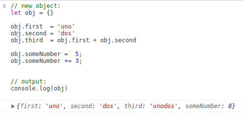

# Sperdify

## Technologies


- [React](https://reactjs.org/)
- [TypeScript](https://www.typescriptlang.org)
    - [Code converter](https://csharptotypescript.azurewebsites.net) - This might be useful for the very beginning of simple Javascript/Typescript woes, like declaring variables.
    - [TypeScript for C# Programmers](https://www.typescriptlang.org/docs/handbook/typescript-in-5-minutes-oop.html)
- [Tailwind](https://tailwindcss.com/)
    - A nice [cheat sheet](https://nerdcave.com/tailwind-cheat-sheet)
- [Vite](https://vitejs.dev/) *(build tool, shouldn't need too much attention)*


## Setup

- *make sure node is installed*

```shell
    # list dependencies
    npm list

    # instalkl dependencies:
    npm install

    # run live build:
    npm run dev

```


---


## Thoughts on learning JS/TS:

I think it's much better to learn Java/C# *(which are very similar)* before Javascript.

To figure out Javascript syntax, I am constantly opening the developer console *(F12)* in Chrome, to enter Javascript straight into the 'Console' tab. It is fast, efficient, has autocompletion, and prints stuff very cleanly.

Obviously, the first apparent syntax differences is types, but not for the reason you initally expect. Primitive types *(in vanilla Javascript)* are:
- `Number` - including integers and floating-point numbers
- `String`
- `Boolean`
- `Null` - variable defined, but is null
- `Undefined` - variable doesn't exist
- `Object` - "empty" object

Except *any* object can have *any* property *(so classes are not mandatory)*:
> 

Lean on Intellicode! I wouldn't start without it!